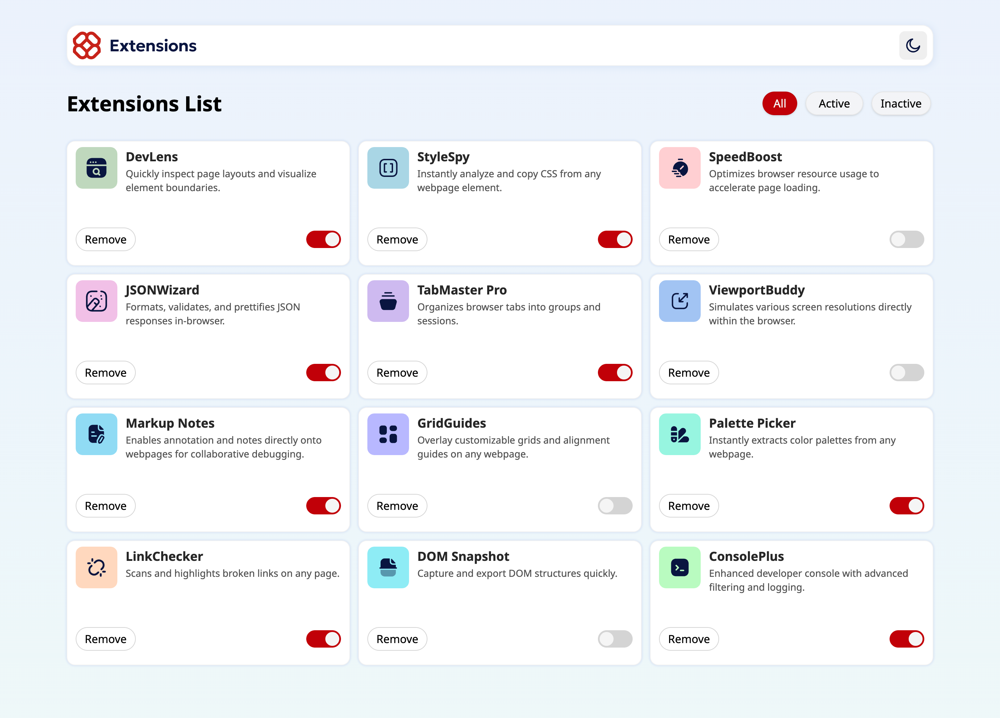
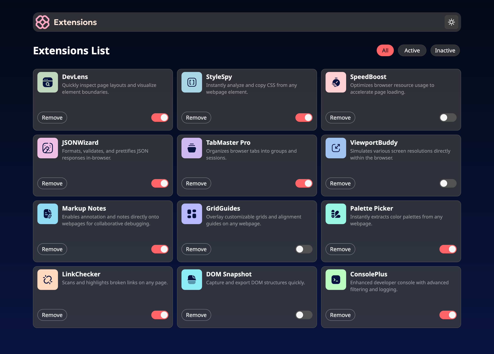
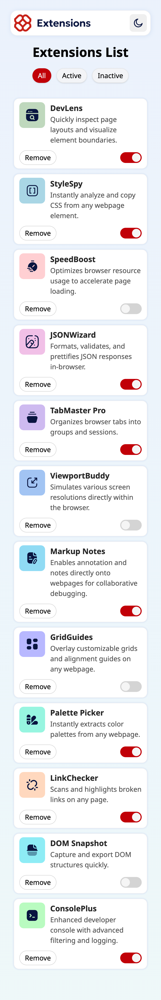
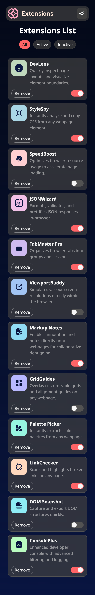

# Frontend Mentor - Browser extensions manager UI solution

This is a solution to the [Browser extensions manager UI challenge on Frontend Mentor](https://www.frontendmentor.io/challenges/browser-extension-manager-ui-yNZnOfsMAp). Frontend Mentor challenges help you improve your coding skills by building realistic projects. 


## Table of contents

- [Overview](#overview)
  - [The challenge](#the-challenge)
  - [Screenshot](#screenshot)
- [My process](#my-process)
  - [Built with](#built-with)
  - [🧗‍♀️ What I learned](#🧗‍♀️-what-i-learned)

## Overview

### The challenge

Users should be able to:

- Toggle extensions between active and inactive states
- Filter active and inactive extensions
- Remove extensions from the list
- Select their color theme
- View the optimal layout for the interface depending on their device's screen size
- See hover and focus states for all interactive elements on the page

### Screenshot

#### Desktop 1044px
|     <a href="screenshots/Desktop1440-light.png"></a>   |
| ---------------------------------------------- |
|     <a href="screenshots/Desktop1440-modal.png"></a> |

#### Mobile 375px
|     <a href="screenshots/Mobile375-light.png"></a>   |
| ---------------------------------------------- |
|     <a href="screenshots/Mobile375-dark.png"></a>  |


## My process

### Built with

- Semantic HTML5 markup
- CSS custom properties
- Flexbox
- CSS Grid
- Mobile-first workflow
- [React](https://reactjs.org/) - JS library
- Tailwind CSS

### 🧗‍♀️ What I learned

1. How to make nested React components
    
    Reference: https://www.youtube.com/watch?v=VcLXh9EdVs0

2. Group focus using Tailwind CSS

   Use `focus-within: xxx` class on a parent element to apply focus styles when any of its descendants are focused.

   ```jsx
   <label className="focus-within:outline-2">
     <input type='checkbox' />
     <div></div>
   </label>
   ```

   Reference: https://stackoverflow.com/a/74349699

